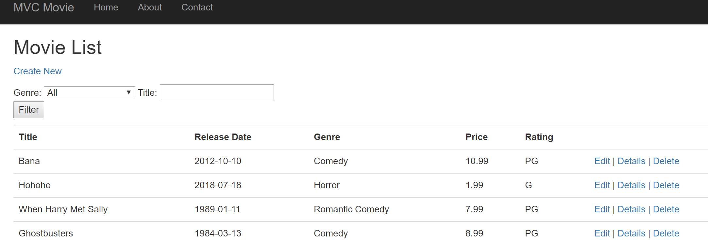
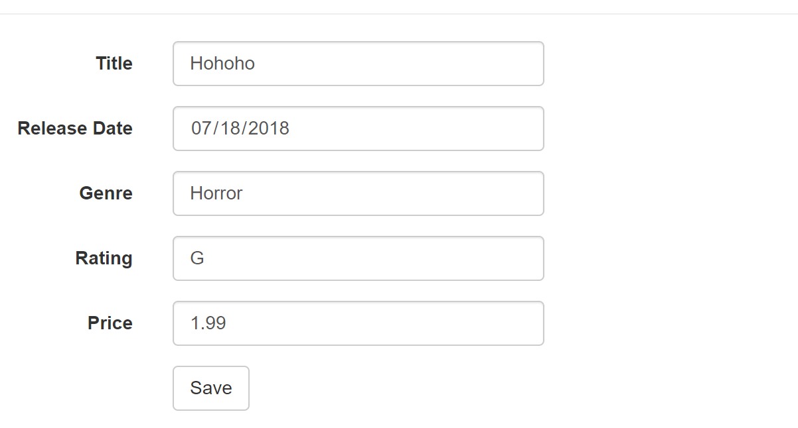

# Lab41-MVC5

This project is for experience ASP.NET 4.7 applications and comparing the similarities of it between .Net Core 2. This project follows the tutorial over on the [Microsoft Docs](https://docs.microsoft.com/en-us/aspnet/mvc/overview/getting-started/introduction/) up until Validation.

This was built in the Visual Studio IDE and MVC 5. It makes use of Entity Framework's Code Migration setup for the database and localDb.

## Run it
1. Download the project, (ASP.NET 4.7)
2. After downloading, you'll need to run in your package manager console the command `Update-database` to ensure that the latest migration and localDb is created on your machine
3. Run the application and you'll be redirected to the MoviesApp

## Visuals

* Home Page

* Creating and Editing Movies

